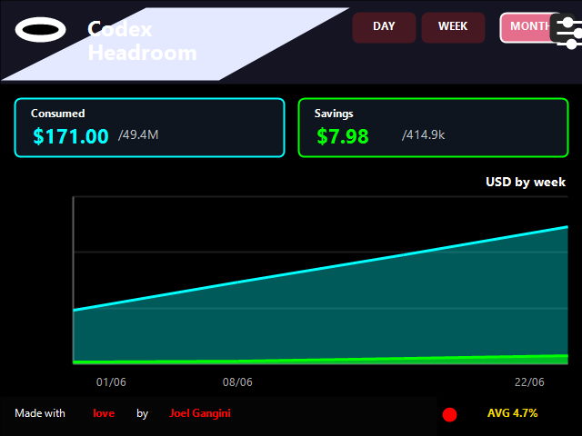

# Codex Headroom

Headroom + Codex on Windows, with an optional **ESP32-CYD near-real-time dashboard** that mirrors the local Headroom report on a small touchscreen device.

## Demo Video

> Coming soon. This section is reserved for the GitHub-hosted demo video.
>
> Replace this block later with your uploaded video URL, similar to:
> `https://github.com/user-attachments/assets/...`



## What this project does

- Runs Headroom as a local proxy for Codex on Windows.
- Keeps the main experience on your computer, using the Headroom proxy at `http://127.0.0.1:8787`.
- Adds an optional ESP32-CYD dashboard that receives compact `HRM2 v3` frames over USB serial.
- Shows near-real-time usage, savings, and range-based charts on a small standalone screen.

## Architecture

```text
Codex -> Headroom proxy (127.0.0.1:8787) -> /health /stats /stats-history
                                               |
                                               +-> headroom-live-bridge.ps1 -> USB serial -> ESP32-CYD
```

- The **Headroom proxy** is the primary product.
- The **CYD bridge** is the source of truth for the device runtime.
- The **ESP32-CYD dashboard** is an optional accessory, not a requirement for Headroom or Codex.

## Hardware

Tested target board:

- **ESP32-2432S028R / CYD**
- 2.8-inch 320x240 TFT touchscreen
- CH340 USB serial
- XPT2046 touch controller

Purchase reference:

- [ESP32-2432S028R / CYD on AliExpress](https://a.aliexpress.com/_mMugmU3)

## Prerequisites

- Windows with PowerShell
- Codex already installed and working
- Headroom installed locally
- Python + PlatformIO for firmware flashing
- A CYD board connected by USB if you want the optional dashboard

## Step 1: Configure Headroom for Codex on Windows

The recommended Windows baseline is:

- proxy at `http://127.0.0.1:8787`
- `agent-90` savings profile
- project-scoped memory
- learning disabled by default
- telemetry disabled

Suggested environment variables:

```powershell
setx HEADROOM_MODE token
setx HEADROOM_SAVINGS_PROFILE agent-90
setx HEADROOM_SAVINGS_TARGET 0.90
setx HEADROOM_TARGET_RATIO 0.10
```

Optional output shaping, if your installed Headroom build supports it:

```powershell
setx HEADROOM_OUTPUT_SHAPER 1
setx HEADROOM_OUTPUT_HOLDOUT 0.1
```

Important:

- Do **not** set `HEADROOM_PROJECT` globally.
- Let Codex or the caller decide the project context per session/request.

## Step 2: Start and validate the Headroom proxy

Start the proxy:

```powershell
headroom.exe proxy --memory --memory-storage=project --no-learn --no-telemetry
```

Validate it:

```powershell
Invoke-RestMethod http://127.0.0.1:8787/health | ConvertTo-Json -Depth 8
Invoke-RestMethod http://127.0.0.1:8787/stats | ConvertTo-Json -Depth 8
Invoke-RestMethod http://127.0.0.1:8787/stats-history | ConvertTo-Json -Depth 8
```

Open the local dashboard in your browser:

```text
http://127.0.0.1:8787/dashboard
```

Notes:

- `http://localhost:8787/dashboard` works too.
- The correct path is `dashboard`, not `dasboard`.
- Some Headroom documentation or builds mention `headroom dashboard`, but your local install may not expose that CLI subcommand. If the proxy is healthy, the browser route above is the most reliable way to open the dashboard.

Useful CLI checks:

```powershell
headroom --version
headroom --help
headroom output-savings
```

`headroom output-savings` can report that no output-savings data exists yet until enough baseline and holdout traffic has accumulated.

## Step 3: Flash the CYD firmware

This repository keeps a single production PlatformIO environment.

Build:

```powershell
$env:PLATFORMIO_BUILD_DIR = ".pio-tempbuild"
py -m platformio run --project-dir firmware -e esp32-cyd
```

Upload:

```powershell
$env:PLATFORMIO_BUILD_DIR = ".pio-tempbuild"
py -m platformio run --project-dir firmware -e esp32-cyd -t upload --upload-port COM4
```

Monitor serial:

```powershell
py -m platformio device monitor -p COM4 -b 115200
```

Adjust `COM4` to match your current Windows serial port.

## Step 4: Run the bridge manually

Recommended replication path:

```powershell
powershell -ExecutionPolicy Bypass -File scripts\start-bridge.ps1
```

That launcher starts the repo-owned bridge and writes local logs in the repository root.

Direct bridge execution:

```powershell
powershell -ExecutionPolicy Bypass -File scripts\headroom-live-bridge.ps1 -Port COM4 -IntervalSeconds 5
```

The bridge:

- polls the proxy
- builds compact `HRM2 v3` payloads
- sends them to the device over USB serial
- auto-reconnects if the board disconnects and comes back on the same or another `COMx`

## Step 5: Optional Windows autostart

Autostart is optional convenience only. The repo-owned manual flow above is the recommended path for replication.

Install the optional bridge autostart wrapper:

```powershell
powershell -ExecutionPolicy Bypass -File scripts\install-autostart.ps1
```

This installer generates wrappers under `%USERPROFILE%\.headroom` and attempts to register a scheduled task for the **bridge only**.

Notes:

- The generated `.headroom` files are convenience outputs, not the canonical source.
- The canonical runtime stays in this repository.
- If Windows refuses scheduled-task registration, keep using the manual launcher or rerun the installer from a context allowed to manage Task Scheduler.

## Near-real-time dashboard features

- Day / week / month reporting views
- Usage and savings computed from the selected range
- Compact chart rendered from bridge-prepared buckets
- Proxy health awareness
- Automatic reconnect after USB disconnect/reconnect
- Touchscreen navigation
- Waiting screen until the bridge starts sending live frames

## Troubleshooting

### The device stays on `Waiting`

- Confirm the proxy is healthy on `127.0.0.1:8787`
- Start the bridge manually with `scripts\start-bridge.ps1`
- Check `bridge.log` and `bridge.err.log`
- Verify the board is present in Device Manager / serial ports

### Windows changed the serial port

The bridge re-resolves the port automatically. If needed, force it manually:

```powershell
powershell -ExecutionPolicy Bypass -File scripts\headroom-live-bridge.ps1 -Port COM4
```

### `Access denied` on the serial port

- Close PlatformIO monitor, Arduino IDE, or any serial terminal using the port
- Wait a few seconds and let the bridge retry

### The dashboard page does not open

- Use `http://127.0.0.1:8787/dashboard` or `http://localhost:8787/dashboard`.
- Double-check the spelling: `dashboard` is correct; `dasboard` will fail.
- Confirm `http://127.0.0.1:8787/health` returns a healthy response first.
- If the browser route works but `headroom dashboard` does not, your installed Headroom version likely does not expose that CLI command yet.

### Scheduled task registration fails

- Remove or rename conflicting older tasks
- Retry from a PowerShell session that is allowed to manage Task Scheduler
- Use the manual launcher if you do not need startup automation

## Development / Verification

Validate the fixture:

```powershell
node scripts\validate-frame.js testdata\sample-hrm2.json
```

Validate the bridge shape with a dry run:

```powershell
powershell -ExecutionPolicy Bypass -File scripts\headroom-live-bridge.ps1 -Once -DryRun -FixturePath testdata\sample-hrm2.json | node scripts\validate-frame.js
```

Generate a local preview image:

```powershell
powershell -ExecutionPolicy Bypass -File scripts\render-ui-preview-v3.ps1 -Mode MONTH -OutputPath outputs\headroom-ui-preview-v3.png
```

Maintain Headroom:

```powershell
uv tool upgrade headroom-ai --reinstall
```

If you need to reinstall from the upstream repository:

```powershell
uv tool install --force "headroom-ai[all] @ git+https://github.com/chopratejas/headroom.git"
```

## License

This project is licensed under the MIT License.

Codex Headroom is an independent project. It is not an official OpenAI or Headroom product.
